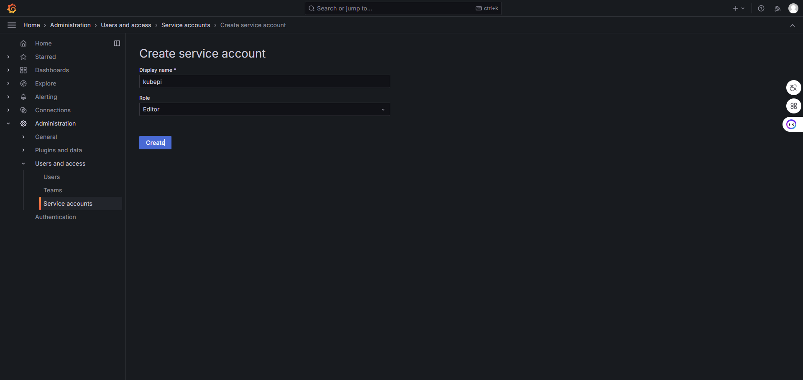
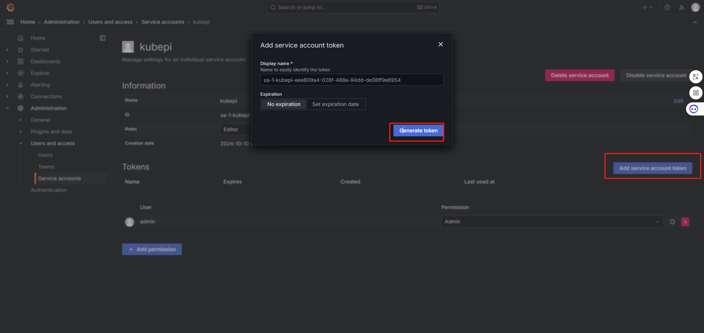
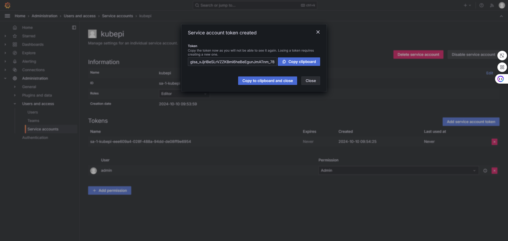
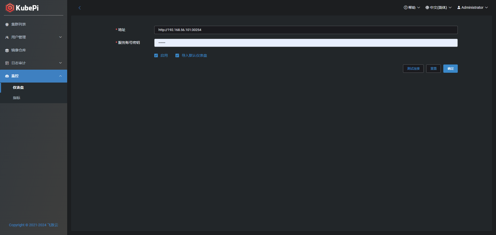
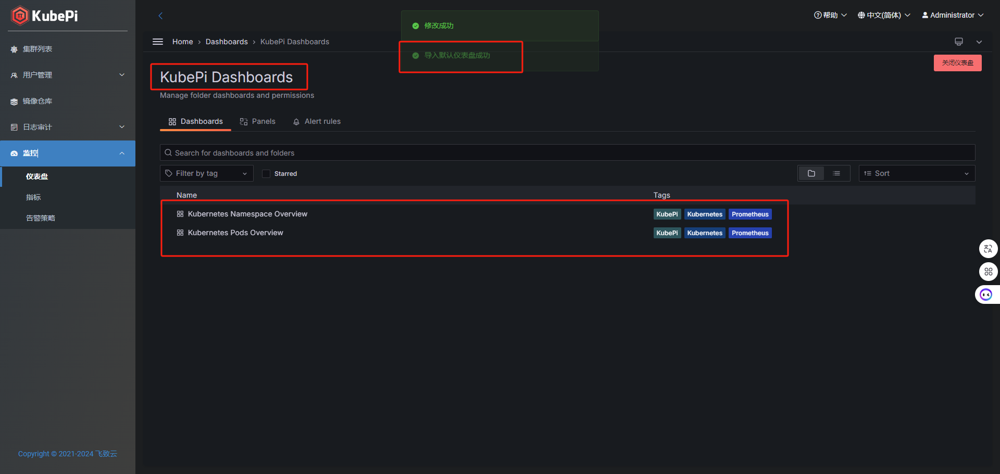
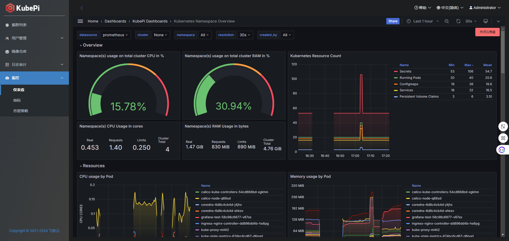
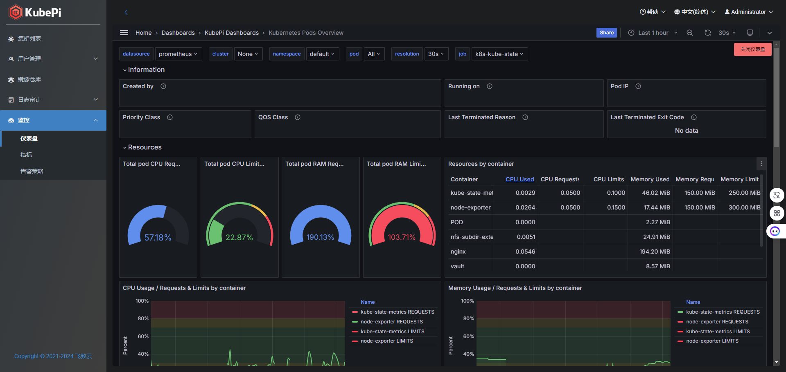

### 一、Grafana
#### 1.1 Grafana快速开始
注意：Grafana如果要被网页进行iframe嵌入，则需要开启命名访问和允许嵌入两个选项
```bash
mkdir data
docker run -d --name grafana \
-v ${PWD}/data:/var/lib/grafana \
--restart=always \
-e GF_AUTH_ANONYMOUS_ENABLED=true \
-e GF_SECURITY_ALLOW_EMBEDDING=true \
grafana/grafana:11.2.2
```


### 1.2 Grafana创建Service account token





### 二、Prometheus
由于Grafana需要对接Prometheus数据源，因此建议将Prometheus部署到K8s集群内部，以下是参考的部署YAML，建议只参考configmap即prometheus的配置文件即可
```bash
apiVersion: v1
kind: ConfigMap
metadata:
  name: prometheus-cm
data:
  prometheus.yml: |
    # my global config
    global:
      scrape_interval:     30s # Set the scrape interval to every 15 seconds. Default is every 1 minute.
      evaluation_interval: 30s # Evaluate rules every 15 seconds. The default is every 1 minute.

    # Alertmanager configuration
    alerting:
      alertmanagers:
      - static_configs:
        - targets:

    # Load rules once and periodically evaluate them according to the global 'evaluation_interval'.
    rule_files:
    scrape_configs:
      - job_name: 'prometheus'
        static_configs:
        - targets: ['127.0.0.1:9090']
    ######## 监控K8s工作节点(服务发现机制监控) ################################################################ 
      - job_name: 'k8s-nodes'
        kubernetes_sd_configs:
        - role: node
        relabel_configs:
        - source_labels: [__address__]
          regex: '(.*):10250'
          replacement: '${1}:9100'
          target_label: __address__
          action: replace
    ######## k8s kube-state-metrics监控任务 ################################################################ 
      - job_name: "k8s-kube-state"
        kubernetes_sd_configs:
        - role: endpoints
        relabel_configs:
        - source_labels: [__meta_kubernetes_namespace, __meta_kubernetes_endpoints_name]
          regex: default;kube-state-metrics
          action: keep
    ######## k8s cAdvisor(服务发现)监控任务 ################################################################ 
      - job_name: 'k8s-cAdvisor'
        kubernetes_sd_configs:
        - role: node
        scheme: https
        tls_config:
          ca_file: /var/run/secrets/kubernetes.io/serviceaccount/ca.crt
          insecure_skip_verify: true
        bearer_token_file: /var/run/secrets/kubernetes.io/serviceaccount/token
        metrics_path: /metrics/cadvisor
    ######## k8s kubelet(服务发现)监控任务 ################################################################ 
      - job_name: 'k8s-kubelet'
        kubernetes_sd_configs:
        - role: node
        scheme: https
        tls_config:
          ca_file: /var/run/secrets/kubernetes.io/serviceaccount/ca.crt
          insecure_skip_verify: true
        bearer_token_file: /var/run/secrets/kubernetes.io/serviceaccount/token
    ######## k8s api-server监控任务 ################################################################ 
      - job_name: 'k8s-apiserver'
        kubernetes_sd_configs:
        - role: endpoints
        scheme: https
        tls_config:
          ca_file: /var/run/secrets/kubernetes.io/serviceaccount/ca.crt
          insecure_skip_verify: true
        bearer_token_file: /var/run/secrets/kubernetes.io/serviceaccount/token
        relabel_configs:
        - source_labels: [__meta_kubernetes_namespace, __meta_kubernetes_endpoints_name, __meta_kubernetes_endpoint_port_name]
          regex: default;kubernetes;https
          action: keep
    ######## k8s 节点调度器监控任务 ################################################################ 
      - job_name: "k8s-scheduler"
        kubernetes_sd_configs:
        - role: node
        relabel_configs:
        - source_labels: [__address__]
          regex: '(.*):10250'
          replacement: '${1}:10251'
          target_label: __address__
          action: replace
        - source_labels: [__meta_kubernetes_node_label_node_role]
          regex: master
          action: keep
    ######## k8s 节点控制器监控任务 ################################################################ 
      - job_name: "k8s-controlle-manager"
        kubernetes_sd_configs:
        - role: node
        relabel_configs:
        - source_labels: [__address__]
          regex: '(.*):10250'
          replacement: '${1}:10252'
          target_label: __address__
          action: replace
        - source_labels: [__meta_kubernetes_node_label_node_role]
          regex: master
          action: keep
```

### 三、KubePi配置
地址：Grafana地址  
服务账号密钥：即在第一步创建的Grafana Service account token（只需要Edit权限就可，无需Admin权限）  
启用：勾选启用之后，点击确定会进行iframe嵌入Grafana页面    
导入仪表盘：勾选之后，默认会对目标Grafana地址，创建 "KubePi Dashboards" 文件夹，并在文件夹下导入仪表盘。（目前只导入“Kubernetes Namespace Overview”、“Kubernetes Pods Overview”。待后续增加~）





注意：因为勾选了开启，下一次进入页面后将自动进行iframe嵌入，所以如果要修改配置，或者关闭Grafana仪表盘，则需要点击右上角红色按钮 <font color="#dd0000">"关闭仪表盘"</font>

