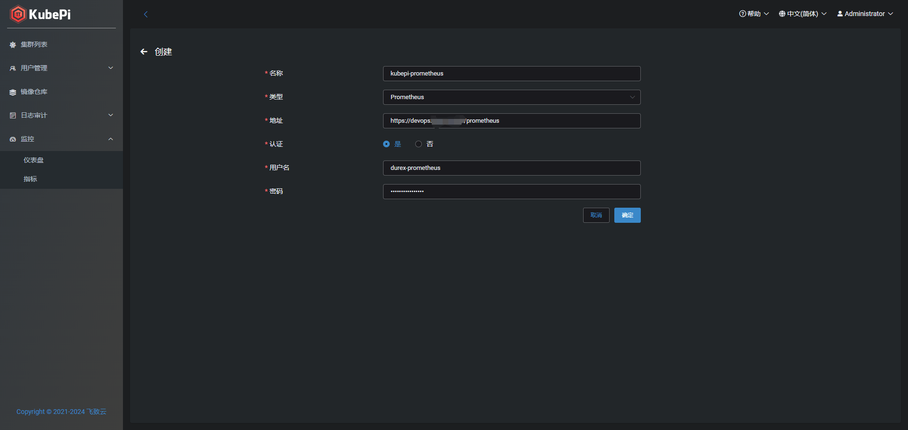
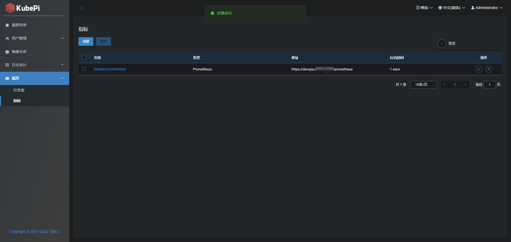
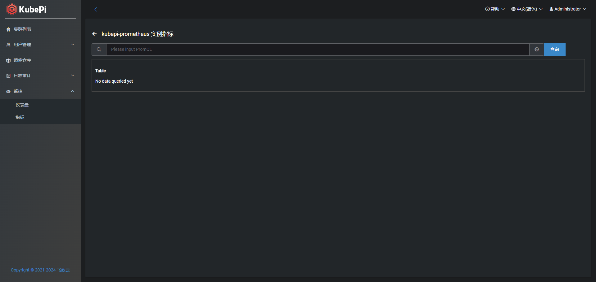
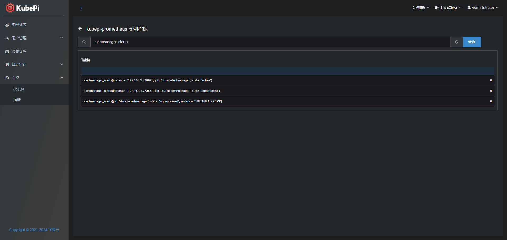
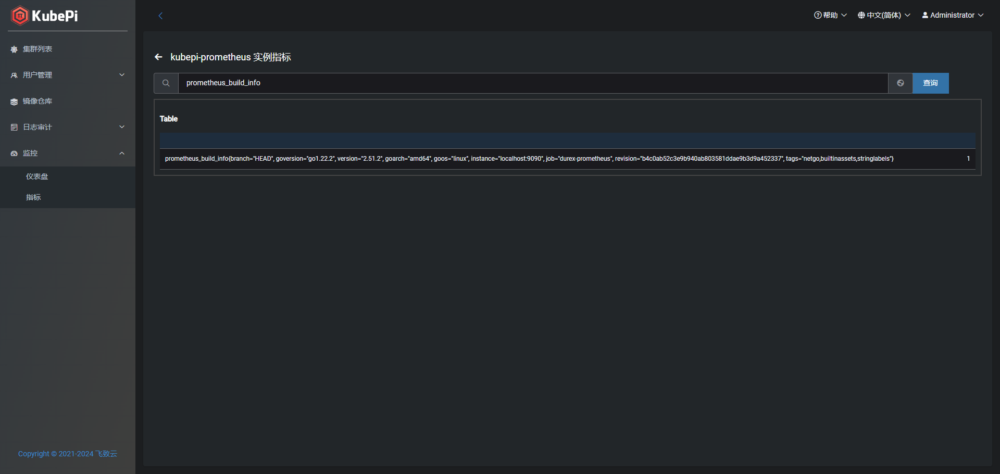

### 一、Metrics
#### 1.1 Prometheus快速开始
注意：这个Metrics功能，相对于是Prometheus WEB UI的功能，只是用来查询prometheus数据的。因此目前只支持添加prometheus类型的监控工具
```bash
docker run -d --name prometheus \
    -v ${PWD}/data:/prometheus \
    --restart=always \
    prom/prometheus:v2.51.2 \
    --config.file=/etc/prometheus/prometheus.yml \
    --storage.tsdb.path=/prometheus \
    --storage.tsdb.retention=720h \
    --web.enable-lifecycle \
    --web.enable-admin-api
```

### 二、KubePi配置
#### 2.1 添加Metrics配置
名称：
类型：目前只支持Prometheus
地址：Prometheus的地址
认证：是否有Basic Auth
用户名：用户名
密码：密码




#### 2.2 执行PromQL查询
点击名称蓝色字体进入Metrics查询界面


