# KubePi使用SSO OpenID Connect

## 一、快速运行KeyCloak
```
docker run --name keycloak-test -d \
	-v ${PWD}/data:/opt/keycloak/data/h2 \
        -e KEYCLOAK_ADMIN=admin -e KEYCLOAK_ADMIN_PASSWORD=123456 \
        -e PROXY_ADDRESS_FORWARDING=true \
        -e KC_PROXY=edge \
        -e KC_HOSTNAME_STRICT_BACKCHANNEL=false \
        quay.io/keycloak/keycloak:21.1.1 \
        start-dev
```

## 二、创建kubepi 领域（可选）
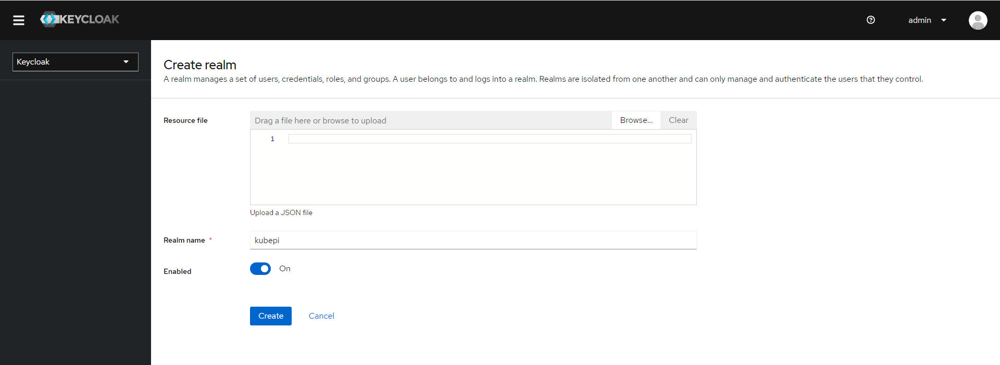

## 三、创建Client
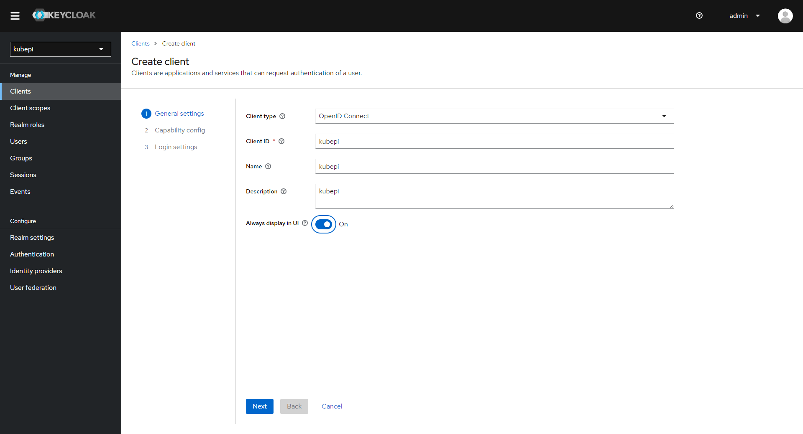

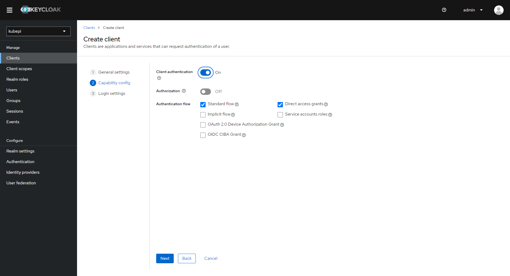

**注意：Valid redirect URIs：kubepi访问地址+/kubepi/api/v1/sso/callback**
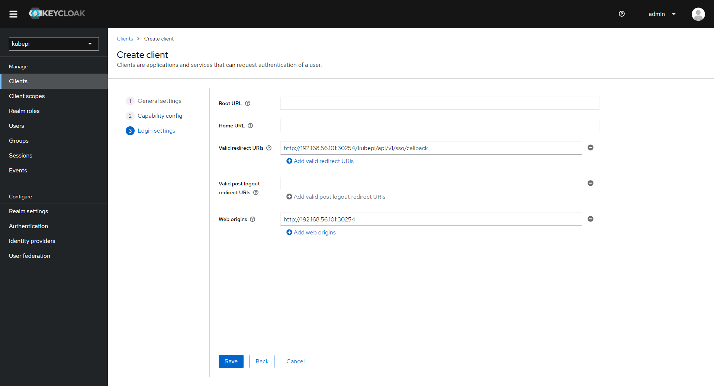

查看Client Secret
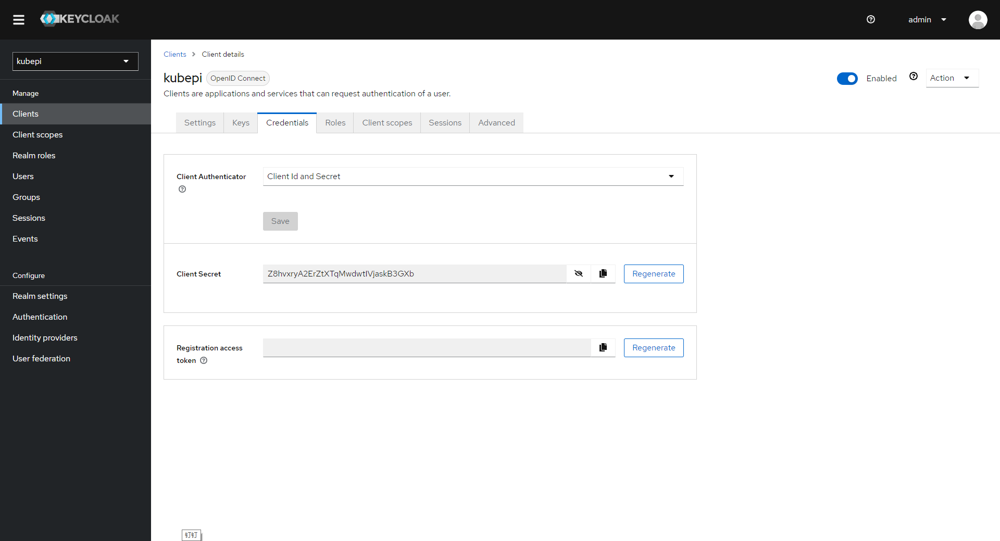

查看issuer接口地址
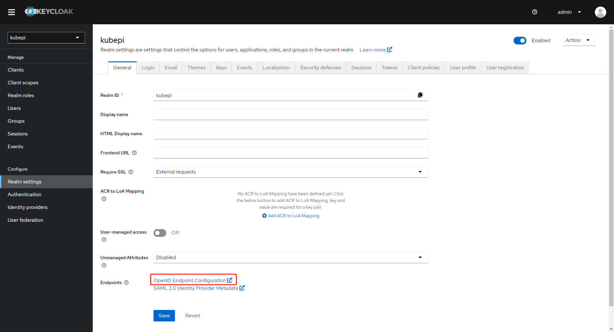

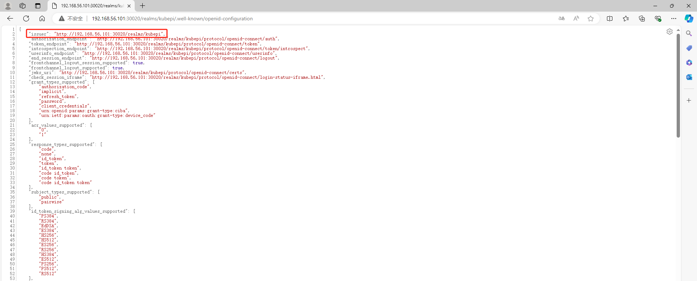

## 四、配置kubepi
```
配置参数描述：
协议：SSO认证协议
接口地址： issuer URL
客户端ID：kubepi
客户端密钥：Z8hvxryA2ErZtXTqMwdwtIVjaskB3GXb
勾选功能开启
```
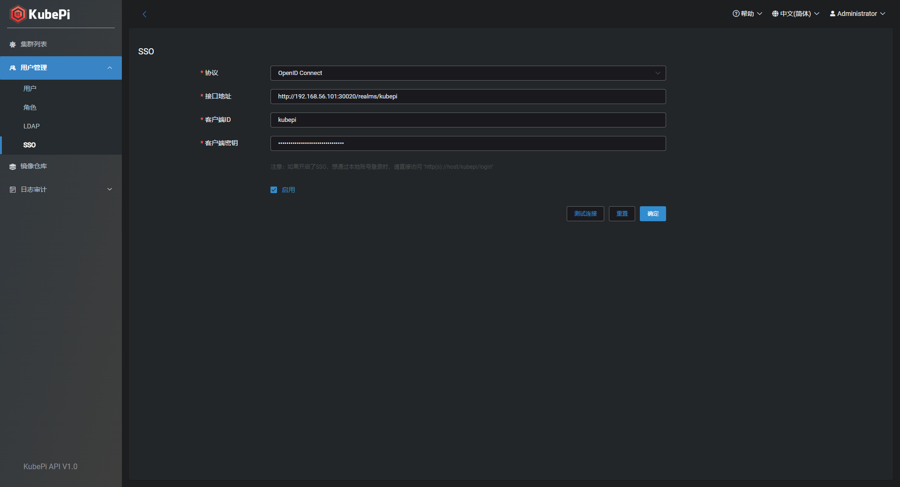

## 五、SSO登录
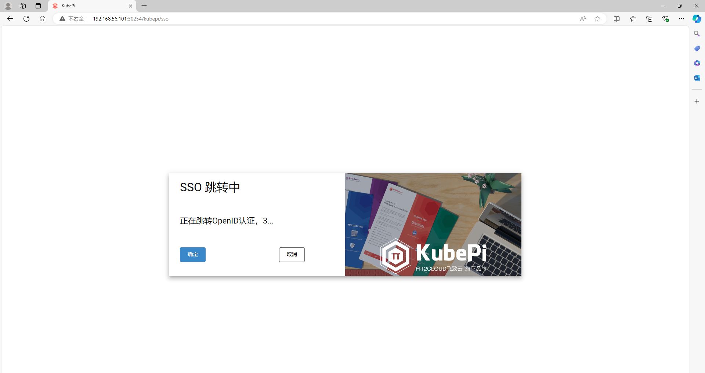

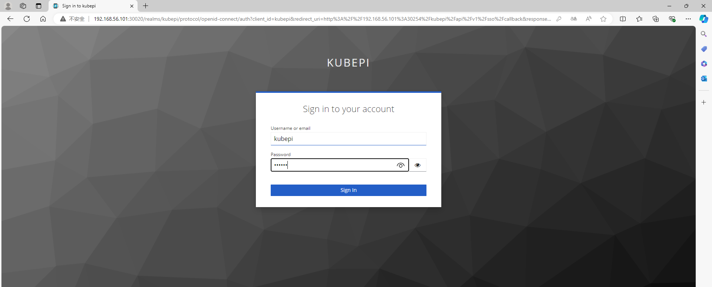

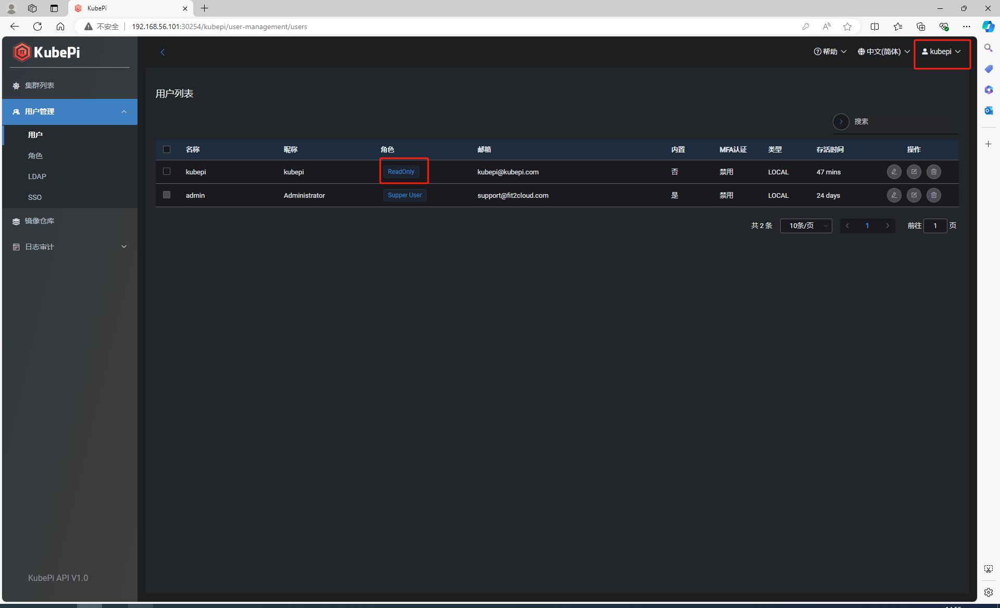
