# KubePi使用SSO SAML2 Connect

## 一、快速运行KeyCloak
```
docker run --name keycloak-test -d \
	-v ${PWD}/data:/opt/keycloak/data/h2 \
        -e KEYCLOAK_ADMIN=admin -e KEYCLOAK_ADMIN_PASSWORD=123456 \
        -e PROXY_ADDRESS_FORWARDING=true \
        -e KC_PROXY=edge \
        -e KC_HOSTNAME_STRICT_BACKCHANNEL=false \
        quay.io/keycloak/keycloak:21.1.1 \
        start-dev
```

## 二、创建kubepi 领域（可选）
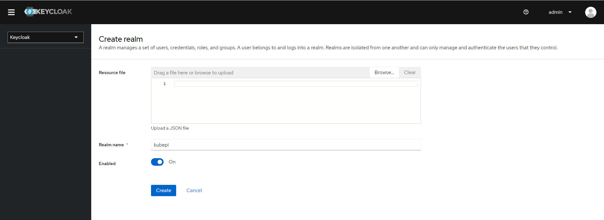

## 三、创建Client scopes
由于KeyCloak 默认SAML2客户端属性映射中不会存在用户名和邮箱，因此需要添加此属性映射
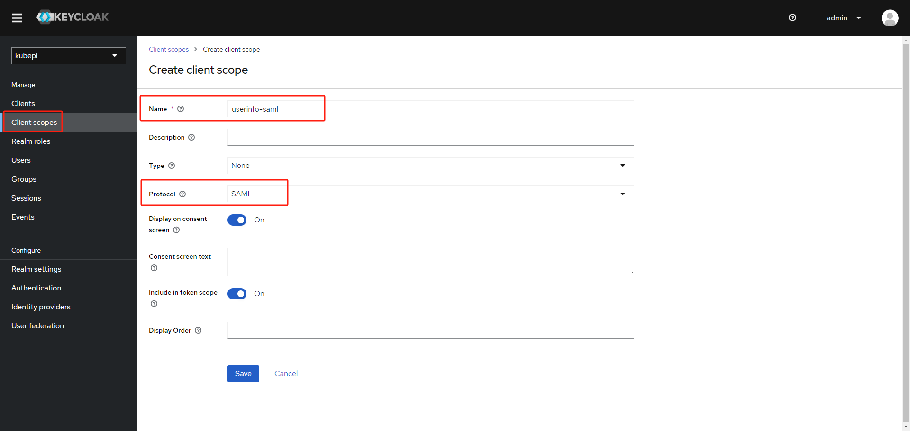
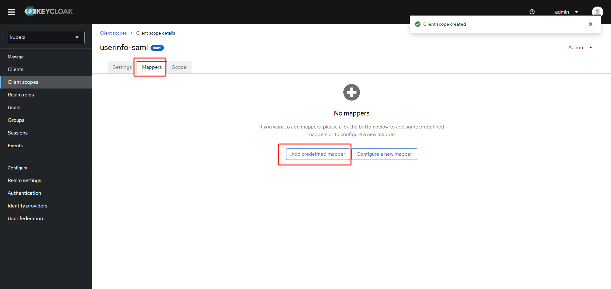
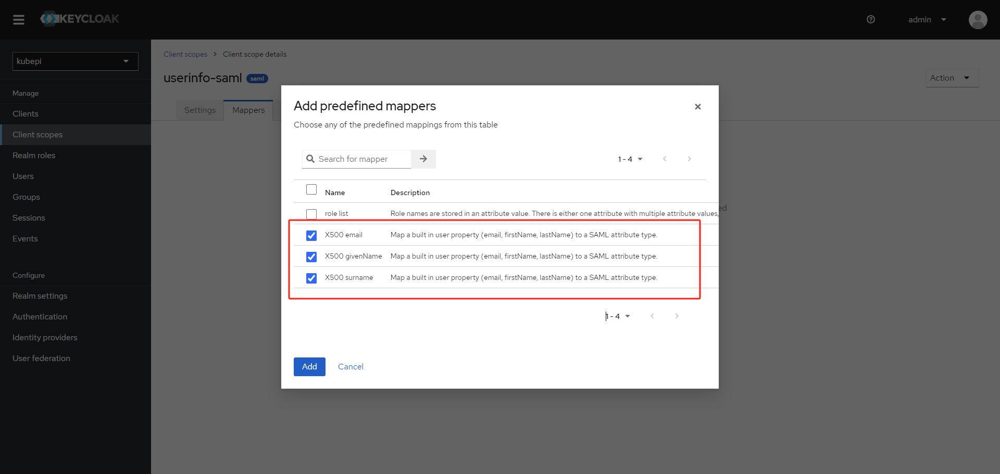

## 四、创建SAML2 Client
**注意：Client ID：kubepi访问地址+/kubepi/api/v1/sso/saml/metadata**
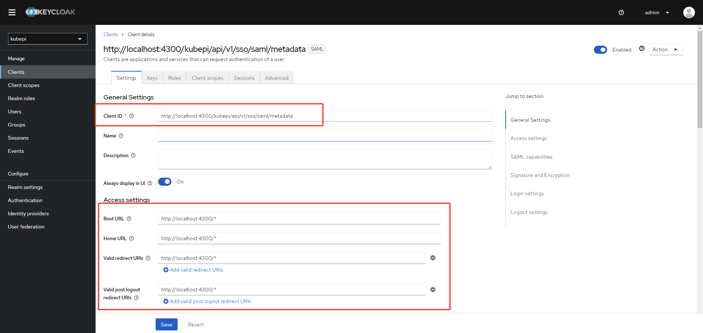

配置高级参数
```
Assertion Consumer Service POST Binding URL: kubepi访问地址+/kubepi/api/v1/sso/saml/metadata
Logout Service POST Binding URL：kubepi访问地址+/kubepi/api/v1/sso/saml/
```
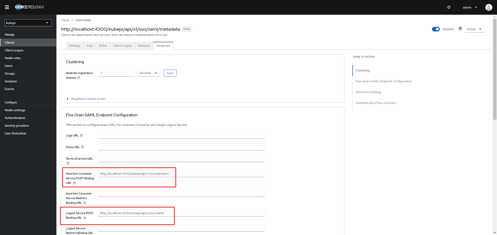

添加Client scope
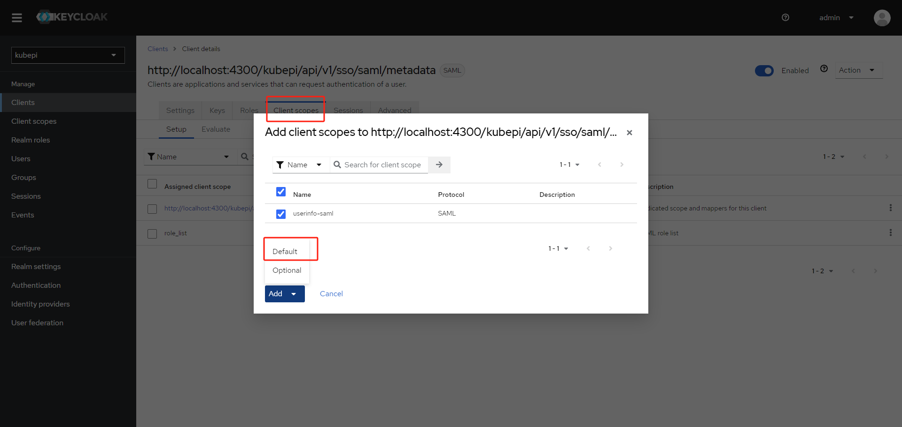

## 四、配置kubepi
```
配置参数描述：
协议：SSO认证协议
接口地址： IDP元数据URL（可到Keycloak realm-settings--->Endpoints --->SAML 2.0 Identity Provider Metadata获取地址）
Certificate：
Certificate Key：
以上两个参数可使用命令生成：openssl req -x509 -newkey rsa:2048 -keyout kubepi.com.key -out kubepi.com.cert -days 365 -nodes -subj "/CN=kubepi.com"
勾选功能开启
```
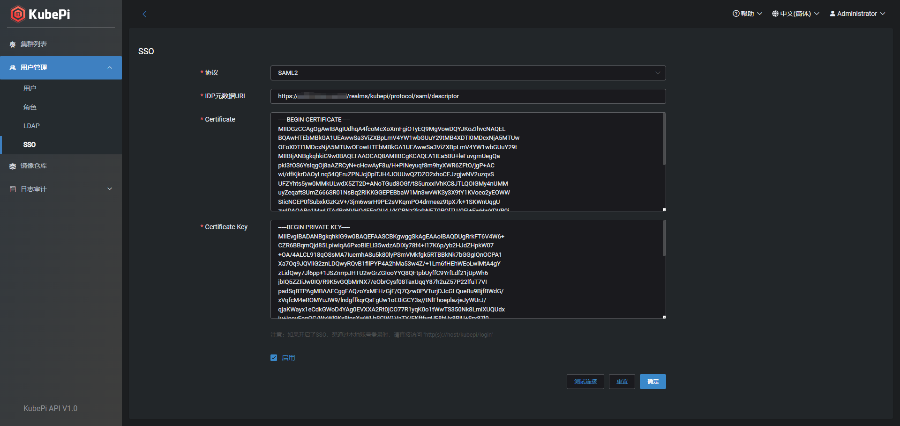

## 五、SSO登录
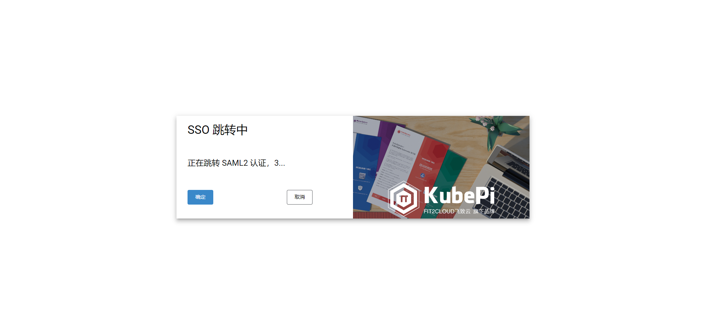
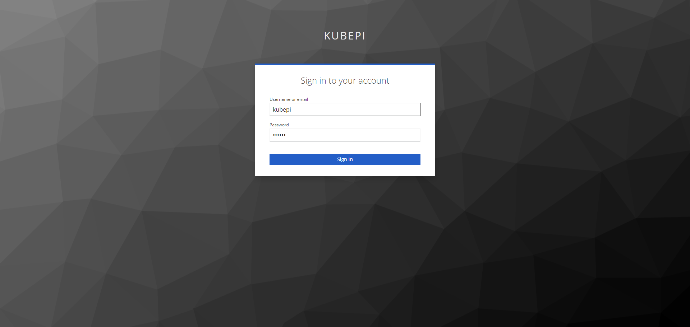
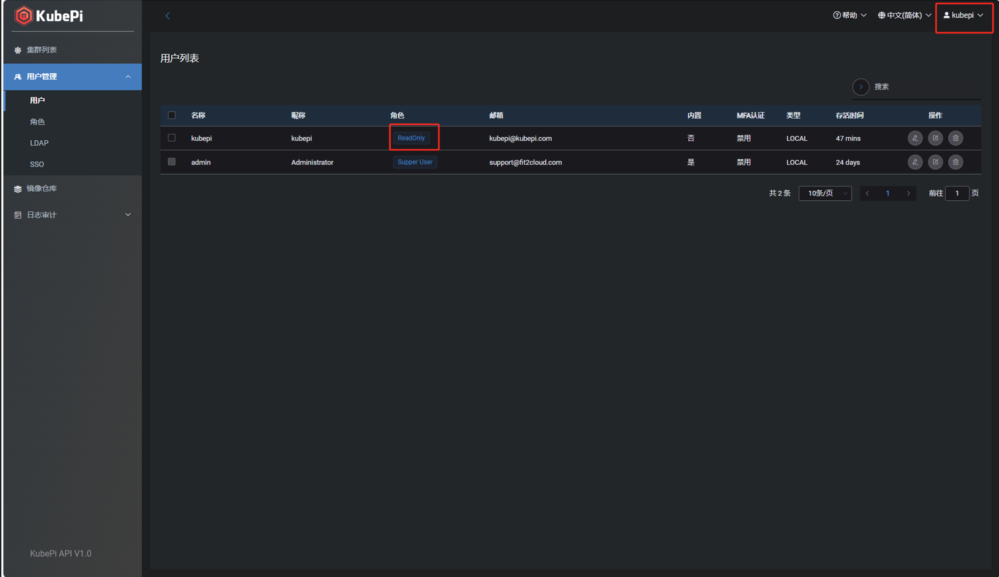